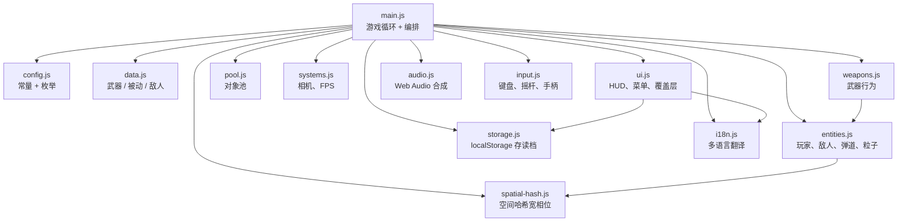

<!--
  Hero banner. The image is committed at docs/hero.svg so it loads on
  GitHub.com without external CDNs and works offline once cached.
-->

<p align="center">
  <a href="https://cvs.tangdan.cc">
    
  </a>
</p>

```
   ____ _   _ ____  _   _ ___ __     __ ___  ____
  / ___| | | |  _ \| | | |_ _|\ \   / // _ \|  _ \
  \___ \| | | | |_) | | | || |  \ \ / /| | | | |_) |
   ___) | |_| |  _ <| |_| || |   \ V / | |_| |  _ <
  |____/ \___/|_| \_\\___/|___|   \_/   \___/|_| \_\
                  零依赖 · 原生 JS · MIT
```

<p align="center">
  <em>一个零依赖的 HTML5 Canvas Roguelite 游戏，30 秒即可克隆、游玩和部署。</em>
</p>

<p align="center">
  <a href="./LICENSE"></a>
  <a href="https://cvs.tangdan.cc"></a>
</p>

<p align="center">
  <a href="https://cvs.tangdan.cc"><strong>▶ &nbsp;在浏览器中游玩</strong></a>
  &nbsp;·&nbsp;
  <a href="#-快速开始">快速开始</a>
  &nbsp;·&nbsp;
  <a href="#-截图">截图</a>
  &nbsp;·&nbsp;
  <a href="#为什么要做又一个吸血鬼幸存者克隆">为什么？</a>
</p>

---

## ✨ 特性一览

|                                                                  |                                                               |                                                                |
| ---------------------------------------------------------------- | ------------------------------------------------------------- | -------------------------------------------------------------- |
| 🧩 **模块化 ES Modules**<br/>简洁可读的 `src/` 文件              | 🎨 **HTML5 Canvas**<br/>固定步长模拟，流畅 60+ fps             | 📦 **零运行时依赖**<br/>无打包工具，无构建步骤                   |
| 🌐 **内置国际化**<br/>默认支持中英双语                            | 🎮 **键盘 / 触屏 / 手柄**<br/>全平台输入一等支持               | 💾 **本地存档**<br/>`localStorage`，无需后端                    |
| ⚙️ **设置面板**<br/>音量、语言、动画                              | ♿ **无障碍支持**<br/>减少动画、高对比度                        | 🧪 **Lint + 格式化**<br/>ESLint, Prettier, CI 检查              |
| 🕹️ **Roguelite 循环**<br/>10 种武器可进化，10 种被动              | 👑 **Boss 与波次**<br/>总监系统含 10 个命名时间窗口             | 🏆 **成就与排行**<br/>12 项成就，前 10 排行榜                   |

## 🎮 操控方式

| 操作           | 键盘                                                        | 触屏                  | 手柄                  |
| -------------- | ----------------------------------------------------------- | --------------------- | --------------------- |
| 移动           | <kbd>W</kbd> <kbd>A</kbd> <kbd>S</kbd> <kbd>D</kbd> / 方向键 | 虚拟摇杆              | 左摇杆 / 十字键        |
| 暂停           | <kbd>Esc</kbd> / <kbd>P</kbd>                               | ⏸ 按钮 / 边缘双击     | <kbd>Start</kbd>      |
| 确认选择       | <kbd>Enter</kbd> / <kbd>Space</kbd>                         | 点击选项              | <kbd>A</kbd> / ✕      |
| 取消 / 返回    | <kbd>Esc</kbd>                                              | 返回按钮              | <kbd>B</kbd> / ○      |
| 切换设置       | <kbd>,</kbd>                                                | ⚙ 图标               | <kbd>Select</kbd>     |
| 切换语言       | <kbd>L</kbd>                                                | 设置 → 语言           | 设置 → 语言           |
| 静音           | <kbd>M</kbd>                                                | 设置 → 音乐           | —                     |
| 帮助 / 快捷键  | <kbd>H</kbd> / <kbd>?</kbd>                                 | "如何游玩"按钮         | —                     |

## 🚀 快速开始

```bash
git clone https://github.com/tangdan2204/canvas-vampire-survivors-.git
cd canvas-vampire-survivors-
npm install     # 仅安装 ESLint + Prettier — 零运行时依赖
npm start       # http://localhost:3000
```

不想装 Node？直接在浏览器中打开 `index.html`，或用 `python -m http.server` 启动文件服务器。

**[🕹️ 在线游玩](https://cvs.tangdan.cc)**

## 📸 截图

|                                                          |                                                         |                                                          |
| -------------------------------------------------------- | ------------------------------------------------------- | -------------------------------------------------------- |
|           |         |        |
|           |         |           |

## 为什么要做又一个吸血鬼幸存者克隆？

大多数 JS 克隆版都附带 5 MB 的打包文件和比游戏本身启动还慢的构建流水线。这个项目反其道而行之：

1. **运行时零依赖。** 没有 React，没有打包工具，没有转译器。打开 `index.html` 游戏就在屏幕上。`package.json` 只列出了 ESLint + Prettier 作为开发工具。
2. **打开浏览器就能玩。** 加载器同时处理 `file://`、`http(s)://` 和离线模式（通过可选的 Service Worker）。非常适合教室、展示终端、直播编程。
3. **完全可审计的源码。** `src/` 下的每个模块都是独立的，不超过 1000 行，带有 JSDoc 头部列出所有导出。没有隐藏的构建产物，没有压缩的第三方代码。
4. **从第一天起就支持国际化和无障碍。** 默认支持中英双语，尊重 `prefers-reduced-motion`，设置中内置高对比度模式，所有菜单均可通过键盘导航。

## 🏗️ 架构

运行时由一个 `main.js` 编排器将各个专注模块连接在一起。每个模块都有明确的职责，且没有运行时依赖。



## 🧱 技术栈

| 层级       | 工具                                                          |
| ---------- | ------------------------------------------------------------- |
| 运行时     | **原生 JS**（ES2022 模块）· **HTML5 Canvas** · Web Audio       |
| 持久化     | `localStorage`（优雅降级为内存存储）                            |
| 移动端     | 虚拟摇杆 · 触屏边缘双击 · PWA Manifest                         |
| 工具链     | **ESLint 9**（扁平配置）· **Prettier 3** · GitHub Actions CI    |
| 部署       | 静态文件服务 · Service Worker                                   |

## ⚡ 性能

v2.3 将碰撞宽相位从 O(n²) 的逐对扫描改为均匀 64px 空间哈希，池化了频繁创建的实体（飘字、粒子），将敌人精灵预渲染到离屏位图缓存中，并将每帧 `dt` 限制为 50ms。模拟在 `document.visibilitychange` 时自动暂停，避免恢复标签页时产生 2 秒的追帧。

| 场景                                     | 优化前（v2.2 估计） | 优化后（v2.3 估计） |
| ---------------------------------------- | ------------------- | ------------------- |
| 100 敌人，无 Boss                         | ~60 fps             | ~60 fps             |
| 250 敌人，弹道齐射中                      | ~48 fps             | ~60 fps             |
| 500 敌人，虚空领主第二阶段                 | **~30 fps**         | **~60 fps**         |
| 切走 60 秒 → 返回，模拟追帧               | 500+ ms 峰值        | ≤50 ms 单步         |

## ♿ 无障碍

- 所有菜单均可通过键盘操作；升级卡片支持 `Enter` / `Space` 和方向键导航
- 可见的 `:focus-visible` 焦点环，覆盖层使用 `role="dialog"` + `aria-modal`
- 尊重 `prefers-reduced-motion`、`prefers-contrast: more`、`forced-colors: active`，内置色盲模式
- 移动端：修复 iOS Safari 100vh 问题，禁用下拉刷新和双指缩放

## 🗺️ 路线图

- [x] 地图变体（森林、地穴、冻原）配备不同敌人池 — _v2.7_
- [x] 手柄支持和菜单导航 — _v2.7_
- [ ] 武器进化组合（武器 × 被动）
- [ ] 元进度：跨局永久解锁
- [ ] 更多语言（ES, JA, FR — 欢迎 PR）
- [ ] 可选 WebGL 渲染器（功能开关）
- [ ] 回放录制和分享

## 🤝 贡献

欢迎贡献！新手请查看 **5 分钟 [贡献快速入门](./docs/CONTRIBUTING_QUICKSTART.md)** — 克隆、运行、提交你的第一个 PR。完整规则见 [CONTRIBUTING.md](./CONTRIBUTING.md)，参与即表示同意 [行为准则](./CODE_OF_CONDUCT.md)。

## 🙏 灵感与致谢

- 灵感来源于 [Vampire Survivors](https://poncle.itch.io/vampire-survivors) by Poncle — 紧凑、令人上瘾的游戏循环的大师之作。本项目是独立致敬作品，与 Poncle 无关。
- Mermaid 架构图，shields.io 徽章，MDN Canvas 参考文档，Mozilla Web Audio 团队的合成 API。
- 每一位提交 issue、发送 PR 或翻译字符串的贡献者。

## 📜 许可协议

基于 [MIT 许可协议](./LICENSE) 发布。自由使用、fork 和分发！

---

*使用 💜 和原生 JavaScript 制作*
